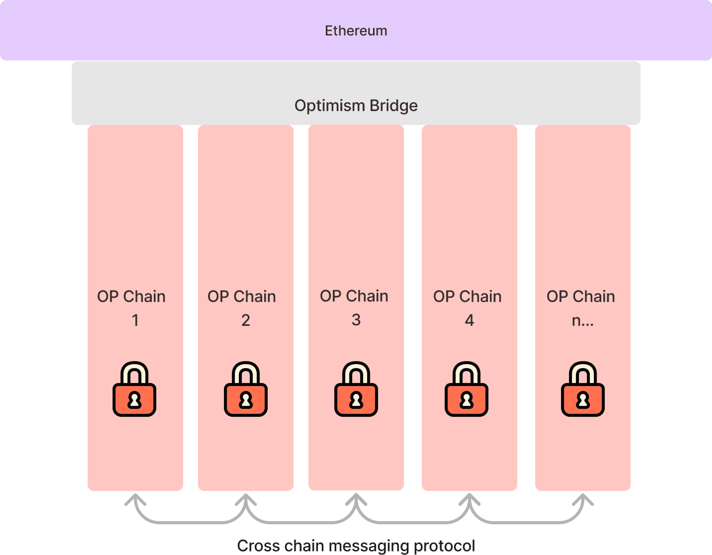

# OP 超级链解释
> 通过订阅[ Optimism 开发者博客 ](https://blog.oplabs.co/)，随时了解超级链和 OP Stack 的最新动态。

在 Bedrock 之后，OP Stack 的下一个主要可扩展性改进是引入超级链的概念：一个共享桥接、去中心化治理、升级、通信层等的链网络——所有这些都建立在 OP Stack 之上。

超级链的推出将把 OP 主网和其他链合并为一个统一的 OP 链网络（即超级链内的链），标志着向世界带来可扩展和去中心化计算的重大一步。本文档的目标是描述可扩展性愿景、超级链概念以及实现这一愿景所需的一些 OP Stack 变更。

这是详细的解释。[ 点击这里查看技术性较低的介绍 ](https://app.optimism.io/superchain/)。

> 今天，超级链是一个概念和正在进行的项目，而不是一个具体的现实。本文档代表了我们对超级链组件、功能和路线图的最佳当前猜测。最终，其实现将取决于（并随着）整个 Optimism Collective 的贡献，我们迫不及待地想看到它的发展方向。

## 可扩展性愿景

### 区块链技术目前不足以支持去中心化网络

不幸的事实是，区块链生态系统尚未实现创建去中心化网络的潜力，即一个通过无许可协议取代可信实体的重新架构的互联网。这主要是因为当前区块链技术的可扩展性限制，导致大多数 Web 应用无法在链上运行——这是自行业诞生以来一直存在的问题。

事实上，早在比特币白皮书发布时，第一条回复就显示了惊人的先见之明：

> *我们非常非常需要这样的系统，但据我理解，你的提议似乎无法扩展到所需的规模。*

**十多年过去了，这一点仍未改变。**

### 可扩展的去中心化计算的价值是巨大的……

想象一下，我们解决了区块链的可扩展性问题。想象一下，在链上进行交易的成本与与集中式后端交互一样便宜。在这个世界里，什么是可能的？

+ 开发者不再需要担心其应用程序所依赖的后端基础设施，因为区块链保证了其应用程序的正确执行、正常运行时间和[ 水平可扩展性 ](https://en.wikipedia.org/wiki/Scalability#Horizontal_(scale_out)_and_vertical_scaling_(scale_up))。
+ 由于共享的智能合约执行环境，可组合性将远远超越传统 REST APIs 的能力。
+ 有了标准化的 Gas 市场，开发者不再需要为用户承担所有的基础设施成本。支付一个病毒式应用程序的费用将不再是应用开发者的进入门槛，并且会解锁更多的货币化策略。

这些特性的结合将使得编写高度可扩展的 Web 应用程序成为可能，并且无需触及传统的后端软件堆栈，消除对后端的担忧。这一价值主张不仅适用于去中心化爱好者，还适用于那些只想发布产品的普通应用开发者。通过可扩展性，区块链可以从一个小众兴趣变成每个开发者工具包中的核心组件。

此外，在这个大多数应用程序都上链的世界中，更多的数据可以通过密码学进行验证。这种密码学可验证性使用户能够建立跨应用程序的声誉。然后，这些声誉可以用于投票、贷款和抵押——促进互联网的信任。而且，由于用户保留对其数据、应用程序和声誉的所有权，因此没有丧失访问权限的风险。

毫无疑问，区块链的承诺可以改变我们所知的互联网。

### ……去中心化网络仍然可以实现

这个假设并不是一个梦想，而是一个具体的愿景，激励了包括 Optimism 在内的许多人为之奉献一生。由于这些集体贡献，我们每年都在区块链技术堆栈方面学到更多内容，并且距离实现这一愿景越来越近。

在行业的支持下，我们认为一个真正可扩展的区块链架构的清晰图景开始浮现。我们称之为“超级链”。本文档阐述了超级链架构的核心技术原则，以及一系列具体项目，我们相信这些项目一旦完成，将最终实现区块链的可扩展性愿景。这将是一个多年的（甚至是十年的）旅程。然而，如果我们大致知道前进的方向，我们将会更快地到达目的地。

## 基础的超级链概念

### 水平可扩展性需要多个链……

区块链的水平可扩展性从根本上需要多个链。这是因为同步一个链的硬件要求随着链执行的计算量线性增加。因此，为了实现水平可扩展性，我们必须并行运行多个链。

> 链：一个状态[转换系统](https://en.wikipedia.org/wiki/Transition_system)——由初始状态、状态转换函数和输入列表（交易）组成——通过密码学验证并且可以使用普通计算机硬件和互联网连接独立复制。

### ……但传统的多链架构是不足的

传统的“多链”架构方法存在两个根本性问题：

1. 每个链引入了一个新的安全模型，随着新链被引入生态系统，导致系统性风险的累积。[相关链接](https://twitter.com/VitalikButerin/status/1479501366192132099?s=20)
2. 新链的启动成本高昂，因为它们需要新的验证者集和区块生产者。

这些问题源于缺乏一个共享的区块链（L1 链），它作为多链系统中所有链（L2 链）的共享真相来源。通过使用共享的真相来源，可以：a) 在所有链上强制执行标准的安全模型；b) 消除链部署需要新验证者集的要求，因为每个 L2 链使用 L1 共识。

### 不是多链，也不是单链……而是超级链

通过使用 L2 链来构建多链生态系统，可以开始将链视为商品——可互换的计算资源。这种链的商品化使开发者能够构建跨链应用，而不会引入系统性风险，也不会因为为其应用部署新链而产生大量开销。链的概念本身可以被抽象化，在这一点上，可以将这个互操作链的网络视为一个单一的整体：超级链。

> 超级链：一个去中心化的区块链平台，由许多共享安全性和技术堆栈（OP Stack）的链组成，其互操作性和标准化使得工具和钱包可以将各个链视为相同的实体。

## 超级链概述

### 一览超级链

超级链是一个由 L2 链组成的网络，这些链被称为 OP 链，它们共享安全性、通信层和开源技术堆栈。然而，与多链设计不同，这些链是标准化的，旨在作为可互换的资源使用。这使得开发者能够构建面向整个超级链的应用程序，并抽象掉应用程序运行的底层链。

> OP 链：Optimism 超级链中的单个链。无论其具体属性如何，只要由 Optimism Collective 正式管理的链都被视为 OP 链，因此是超级链的一部分。

### 超级链的属性

为了使 Optimism 升级为超级链，它必须具备以下属性：

| 属性 | 目的 |
|----------|----------|
| 共享的 L1 区块链 | 提供所有 OP 链之间交易的总排序。 | 
| 所有 OP 链的共享桥接 | 使 OP 链能够拥有标准化的安全属性。 |
| 低成本的 OP 链部署 | 允许在 OP 链上进行部署和交易，而无需支付在 L1 上交易的高额费用。 |
| OP 链的配置选项 | 允许 OP 链配置其数据可用性提供者、排序器地址等。 |
| 安全的交易和跨链消息 | 使用户能够安全地在 OP 链之间迁移状态。 |

一旦 Optimism 满足了这些属性，它就可以被视为一个超级链。

## 将 Optimism 升级为超级链

我们认为，在 Bedrock 版本发布之后，以下更改是创建初始超级链所必需的，这些更改将使得可以使用相同的桥接来部署和升级多个链：

### 将 Bedrock 桥接升级为链工厂

Bedrock 引入了 [SystemConfig 合约](https://github.com/ethereum-optimism/optimism/blob/74a63c94d881442b4edd4df6492513e0113eb064/packages/contracts-bedrock/contracts/L1/SystemConfig.sol)，该合约开始通过 L1 智能合约直接定义一些 L2 链。这可以扩展为将定义 L2 的所有信息放在 L1 链上，包括生成唯一的链 ID、关键配置值（如区块 gas 限制）等。

一旦链数据完全上链，我们可以创建一个工厂来为每条链部署配置和所有其他所需的合约。通过使用 CREATE2 使合约地址具有确定性，可以进一步扩展这一步骤，这意味着给定一个链配置，就可以确定与该链相关的所有桥接地址。这也使得链可以在不部署其桥接合约的情况下进行交互，使得（与常识相反）链部署几乎免费，并允许链继承标准的安全属性。

### 使用链工厂派生 OP 链数据

Bedrock 引入了从 L1 链派生 L2 链的机制，其中所有链数据都可以基于 L1 区块进行同步。通过将 L1 链工厂扩展为将所有配置上链，Optimism 节点应该能够在给定一个 L1 地址和连接到 L1 的情况下，确定性地同步任何 OP 链。

> 当 OP 链同步时，链状态在本地计算。这意味着确定 OP 链的状态是完全无许可且安全的。链派生不需要证明系统，因为所有无效交易都会被节点执行的本地计算过程简单地忽略。然而，仍然需要一个证明系统来实现超链的提现功能。

### 无许可的证明系统以实现提现

在 Bedrock 中，有一个许可角色（“提议者”角色）要求用户提交提现请求。此外，提议者必须在设定的时间间隔内向 L1 提交提案。随着超链中链数量的增加，这引入了线性开销，甚至由于 L1 资源的有限性引入了链数量的上限。

为了解决这些问题，我们可以引入两个功能：

1. 提现声明（即无许可提案）——允许任何人提交提现请求（即提案），而不仅仅是指定的提议者。这从系统中移除了许可角色，使用户能够提交自己的提现消息。
2. 按需提案，无需提交间隔——使提现声明仅在用户需要提现时才进行，这消除了部署新 OP 链时产生的开销。

> 提现声明：在一条链上对另一条链的状态进行声明。例如，我可以声明在 OP 主网上销毁了我的代币，目的是将这些代币提现回 L1。

我们可以通过在 Optimism 桥接合约中引入无许可的证明系统来首先实现这两个功能。通过 Bedrock 引入的模块化证明设计，证明可以采用故障证明或有效性证明（例如零知识证明）的形式。然而，在有效性证明投入生产之前，我们假设提现将使用故障证明系统。

在设想的故障证明系统中，任何人都可以提交提现声明，并且可以随时提交。当附带保证金时，提交提现声明可以是无许可的，因为如果声明被证明无效，这些保证金将作为抵押品。如果挑战者成功挑战了声明，保证金将支付给挑战者，以奖励他们在保障系统安全方面的参与，从而在这个无许可系统中也能防止垃圾信息。此外，不需要定期提交这些声明，因为故障证明游戏可以有效地证明自“创世纪”以来的整个链历史。

故障证明的实现可能最初依赖于一组受信任的链见证者作为争议的最终仲裁者。挑战者必须从大量链见证者那里请求证明，并将这些证明组合成一个称为证明证明的单一交易。然后，证明证明用于挑战无效声明。

基于证明的故障证明应设计为优先考虑安全性而非活性。这意味着如果这些链见证者是恶意的，他们不能单独破坏提现的安全性。他们可能造成的最严重的失败是阻止提现处理，直到下一次升级——这是一种活性失败。

未来，证明证明将逐步被信任最小化的证明（如 [Cannon 证明系统](https://github.com/ethereum-optimism/cannon)）所取代。

### 每个 OP 链的可配置排序器

Bedrock 引入了在 SystemConfig 合约中设置排序器地址的功能。随着我们为每个链引入各自的 SystemConfig 合约，我们可以使 OP 链的部署者配置排序器地址。我们称这种可配置排序器设计为模块化排序。这使得 OP 链可以由不同的实体进行排序，同时保留标准的 [ 超级链桥 ] 安全模型——这是实现排序器去中心化的关键一步。

> 模块化排序：在 OP 链部署期间配置排序器地址的能力，这个值可以由 OP 链的部署者进行配置。

> 超级链桥：管理超级链中所有 OP 链的 L1 桥合约，这个桥可以由 Optimism Collective 升级。

在超级链桥的安全模型中，链的安全性（即有效性）和链的活性（即抗审查性）都得到了保证。安全性由证明系统保证，活性则通过直接向 L1 提交交易的能力来保证。安全性和活性的结合意味着，如果某个 OP 链的排序器行为不端，用户总是可以向 L1 提交交易，迁移到具有正常功能排序器的新 OP 链使用。

模块化排序还允许对不同的排序模型进行无许可的实验。开发者可以设想实现各种排序协议，例如：轮询排序、排序器共识协议、PGA 排序或 FIFO 排序。我们可以预期，随着不同排序协议之间的竞争，用户友好的排序标准将逐渐出现。

### 所有 OP 链的统一升级路径

为了确保初始超级链在安全性和去中心化方面具有高度的信心，应引入一个去中心化的安全委员会来负责管理升级。安全委员会应能够更新链验证者的集合、延迟启动合约升级，并在紧急情况下按下桥暂停按钮，同时取消待定的升级。

在紧急情况下暂停桥的能力意味着，在最坏的情况下，如果安全委员会成员的私钥泄露，结果将是提款被无限期暂停，桥升级被永久取消。换句话说，L1 桥将被冻结。这遵循了安全优先于活性的设计原则——即使这意味着 ETH 或代币被锁定（即牺牲活性），也应始终防止 ETH 或代币的损失（即执行安全性）。

**通过 L1 软分叉解冻桥：**
为了应对冻结的桥，L2 社区讨论了一种潜在的最终恢复机制，我们称之为“L1 软分叉升级恢复”机制。该机制允许 L1 通过软分叉启动桥升级，绕过超级链桥合约中的所有其他权限。

**该机制如下：** 
任何人都可以通过向一个特殊的桥合约提交交易并附带一笔非常大的保证金来提议升级。这将开始为期两周的挑战期。在此挑战期内，任何人都可以提交挑战，一旦成功便立即取消升级并领取保证金。在正常情况下，由于取消升级的巨大激励，不可能有升级在所需的两周内未被取消。然而，如果升级伴随着对以太坊 L1 验证器软件的修改（即 L1 软分叉），这将忽略包含取消交易的区块，那么升级可能会成功。

> 这种机制可能会给以太坊带来[系统性风险](https://web.archive.org/web/20231102063913/https://vitalik.ca/general/2023/05/21/dont_overload.html)，需要在实施前进行研究并获得社区的支持。它不是实现超级链所必需的，仅为研究完整性而记录。在没有进一步研究其影响和安全性的情况下，团队目前不支持这种方法。

虽然这种类型的成功升级将代表以太坊 L1 的一次软分叉，但它不会给以太坊代码库带来长期的技术债务，因为软分叉逻辑可以在升级完成后移除。

我们预计这个应急机制永远不会被使用，但它的存在本身就可以威慑恶意行为。

### 这些功能的结合形成了一个满足超级链核心属性的系统

我们相信这些升级可以为所有 OP 链提供一个共享的桥、廉价的 OP 链部署、重要的配置选项，以及安全的交易和跨链消息。由于 Bedrock 版本已经提供了共享 L1 区块链的属性，在这些更改之后，我们将实现超级链所需的所有核心属性。

## 扩展超级链增强功能以实现愿景

我们预计，如果成功，Bedrock 之后的超级链发布将标志着 Optimism 在可扩展性和去中心化方面的一个重要里程碑。然而，在实现完全可扩展的区块链愿景之前，仍然存在一些必须解决的重大痛点。预期的痛点包括：

- 提款声明依赖于一组可信的链验证者。
- 跨链交易速度慢，因为需要等待挑战期。
- 跨链交易是异步的，无法执行原子跨链交易（如闪电贷）。
- 向超级链发布交易不可扩展，因为交易数据必须提交到容量有限的 L1。
- 没有易于使用的框架来构建利用多个 OP 链的可扩展应用程序。
- 没有易于使用的钱包来管理多个 OP 链上的代币和应用程序。

如果解决了这些痛点，就有可能构建去中心化的替代方案，甚至是最复杂的 Web2 应用程序。

以下是潜在未来增强功能的概述，这些增强功能结合在一起可以解决上述每一个痛点。

### 多重证明安全性

**痛点：** 1. 提款声明依赖于一组可信的链验证者。

**解决方案：** 

可以通过引入无许可的证明（如 Cannon）来替代可信的链验证者集合，其中争议解决完全在链上进行。然而，完全在链上的证明面临的挑战是，如果它们失效，就没有备用机制。为了确保它们永远不会失效，可以引入一个通过冗余提供安全性的多重证明系统。有关多重证明设计的更多信息，请点击[这里](https://web.archive.org/web/20230331065342/https://medium.com/ethereum-optimism/our-pragmatic-path-to-decentralization-cb5805ca43c1)。

### L2 到 L2 消息传递的低延迟

**痛点：** 2. 跨链交易速度慢，因为需要等待挑战期。

**解决方案：** 

故障证明引入了用户体验负担，因为它们需要等待挑战期才能安全地完成。这意味着，根据挑战期的长短，用户可能需要等待很长时间才能将他们的 ETH 和代币从一个 OP 链迁移到下一个。

另一方面，有效性证明没有这个问题。有效性证明没有挑战期，因此可以实现从一个 OP 链到下一个的即时提款。如果用户在正常应用程序执行期间频繁在链之间迁移，这一点非常重要。然而，有效性证明通常使用零知识证明（ZKP）实现，这些证明既昂贵又容易出错。可能需要数年时间才能真正将 ZKP 生产化，使其成为主要的跨链通信协议。

在 ZKP 生产化的过程中，可以使用 OP Stack 的模块化证明系统实现低延迟的 L2 到 L2 消息传递。通过模块化证明，可以为同一链使用两种证明系统。这提供了使用一种证明系统提供低延迟桥接（以牺牲安全性为代价），同时使用另一种证明系统提供高安全性、高延迟桥接的可能性。

这种异构桥接系统意味着开发者可以使用多种桥接类型之一来构建他们的应用程序，例如：
- 高安全性、高延迟的故障证明（标准高安全性桥）
- 低安全性、低延迟的故障证明（短挑战期以实现低延迟）
- 低安全性、低延迟的有效性证明（使用可信链验证者代替 ZKP）
- 高安全性、低延迟的有效性证明（ZKP 准备就绪后）
  
混合多种证明系统使开发者能够为低价值状态提供低延迟桥接，为高价值状态提供高延迟桥接。甚至可以通过使用高安全性、高延迟桥接证明状态的有效性，将即时桥接的低安全性状态转变为高安全性状态。这个构建模块使开发者能够进行有趣的安全性权衡，例如使用高阈值验证证明与高安全性、高延迟故障证明后备机制。

### 同步跨链交易

**痛点：** 3. 跨链交易是异步的，无法执行原子跨链交易（如闪电贷）。

**解决方案：** 

传统的跨链消息传递是异步进行的，这意味着跨链交易不是原子的。例如，如果用户想要执行跨链套利交易——在链 A 上购买代币 A，并在链 B 上出售代币 B——则无法保证他们的交易能够完整执行。用户可能会在没有出售代币 B 的情况下购买代币 A。

可以通过在两个 OP 链上使用共享排序协议，引入同步跨链消息传递并实现原子跨链交互。在我们的例子中，链 A 和链 B 上的排序器将分别接收到套利交易，达成共识后决定何时包含该交易，然后在链接的区块中原子性地包含每个交易。只有当交易确实在每个链上都被包含时，才会支付费用，这意味着排序器承担了同步风险，而不是我们初始例子中的用户。这些共享排序协议可以在 Bedrock 之后的超级链的模块化排序层上无许可地实现。

通过结合低延迟的 L2 到 L2 消息传递和共享排序，可以执行复杂的交易，如跨链闪电贷。甚至可以进一步创建一个 EVM 抽象，其中单个智能合约（甚至单个存储槽）存在于不同的链上。

### 备用数据可用性层 — Plasma 协议

**痛点：** 4. 向超级链发布交易不可扩展，因为交易数据必须提交到容量有限的 L1。

**解决方案：** 

目前，L1 数据可用性（DA）几乎无法扩展到支持互联网级别的规模。然而，可以通过使用 Plasma 协议扩展 OP 链可访问的数据可用性量，该协议允许备用 DA 提供者补充更有限的 L1 DA。

> Plasma 链：一种交易数据提交到 L1 但不直接提供给 L1 的链，具有数据可用性挑战后备机制。

通用的 Plasma 协议能够扩展到超出 L1 的能力，因为只有对交易数据感兴趣的用户才会下载 Plasma 数据，而在 L1 上，每个以太坊节点都会下载所有的 L1 交易数据。这意味着 Plasma 数据非常便宜。然而，Plasma 的安全模型比 L1 差——Plasma 链数据可能会暂时不可用，这意味着用户必须从链上撤回。请注意，这种安全模型仍然保证了 Plasma 链的安全性，但不保证活性。

**Plasma 协议概述：**
- 数据可用性（DA）提供者从用户那里接收交易数据。
- DA 提供者然后对交易数据进行哈希处理，并将哈希提交到 Plasma 合约。
- 一旦哈希被提交，DA 提供者会向用户发送一个证明，证明他们的交易数据已包含在哈希中。DA 提供者可能会应为扣留证明（即不发送给用户）被标记不端行为。
- 如果 DA 提供者没有向用户发送证明，用户可以提交 DA 挑战，这迫使 DA 提供者将交易数据发布到链上。如果 DA 提供者没有将证明发布到链上，哈希将被删除，这确保了用户始终可以（在挑战期后）同步 Plasma 链。
  - 如果 L1 拥堵严重，DA 挑战期可能会延长。
- 用户还可以提交 L1 交易以从 Plasma 链撤回，以更换他们的 DA 提供者。
- Plasma 链的结算使用与 Rollup 链几乎相同的故障证明系统，唯一的区别是附加数据是使用在 Plasma 合约中最终确定的哈希从链上派生的。

由于哈希能够将任意大小的数据减少到恒定大小的承诺，并且能够并行化交易数据的哈希处理，使用 Plasma DA 可以实现近乎完美的水平扩展数据承诺。这意味着可以将大规模可扩展的应用程序（如游戏或社交媒体）放在 Plasma 链上。

### 多链应用框架

**痛点：** 5. 没有易于使用的框架来构建利用多个 OP 链的可扩展应用程序。6. 没有易于使用的钱包来管理多个 OP 链上的 ETH、代币和应用程序。

**解决方案：** 

这不是核心协议的变更，而是可以在核心超级链协议之上构建的工具。这里的建议旨在提供一些粗略的直觉，说明如何构建工具以改善在超级链上部署的体验。

以下是一些可以改善在超级链上开发体验的工具：

1. 内容可寻址智能合约——这使得合约在所有链上具有相同的地址。这样，开发者可以编写智能合约，这些合约可以在所有 OP 链上以相同的地址进行部署。如果某个 OP 链上的用户想要使用尚未在其链上可用的智能合约，他们可以独立部署代码。
2. 跨链合约状态管理标准——创建智能合约状态从一个链迁移到下一个链的标准，使开发者能够在多条链上分片他们的应用程序。此外，这种逻辑可以在钱包中使用，以显示用户状态，就像所有状态都在同一条链上一样。例如，如果用户的代币分布在多条链上，钱包可以使用跨链状态管理逻辑来显示用户余额，作为所有链上代币余额的总和。
    > 对于以太坊可扩展性爱好者：这些框架可以通过简化用户状态从膨胀链迁移到新链的过程来解决状态增长问题。旧的膨胀链可以通过设置低 gas 限制来维护，或者完全弃用。
3. 超级链 RPC 端点——创建一个单一的 RPC 端点，用户可以在其中发送他们的超级链交易，而不管这些交易是针对哪个 OP 链的，从而使用户避免频繁切换网络。

有了强大的多链应用框架，部署跨链应用程序可能会像部署针对单一链的应用程序一样简单。

## 参与进来

我们相信，扩展区块链将彻底去中心化互联网，并使创建水平可扩展、安全且去中心化的 Web 应用程序变得容易。我们认为，OP Stack 的超级链发布可能标志着实现这一愿景的重要一步。然而，在发布之后，实现可扩展性愿景仍需要大量的工作。

然而，巨大的挑战也带来了巨大的机遇！实现 OP Stack 初始超级链发布所需的工作，以及由此产生的生态系统，将为想要贡献的开发者创造令人兴奋的全新机会，将会有大量的低垂果实贡献被解锁。我们无法单独完成这一切！我们希望实现这一目标的唯一途径是通过像你这样的人的开源贡献！并且通过[回溯性公共物品资助](https://web.archive.org/web/20231217000541/https://medium.com/ethereum-optimism/retroactive-public-goods-funding-33c9b7d00f0c)，你的开源贡献也可能会得到回报！

激动人心的时刻即将到来。

保持乐观 🔴✨