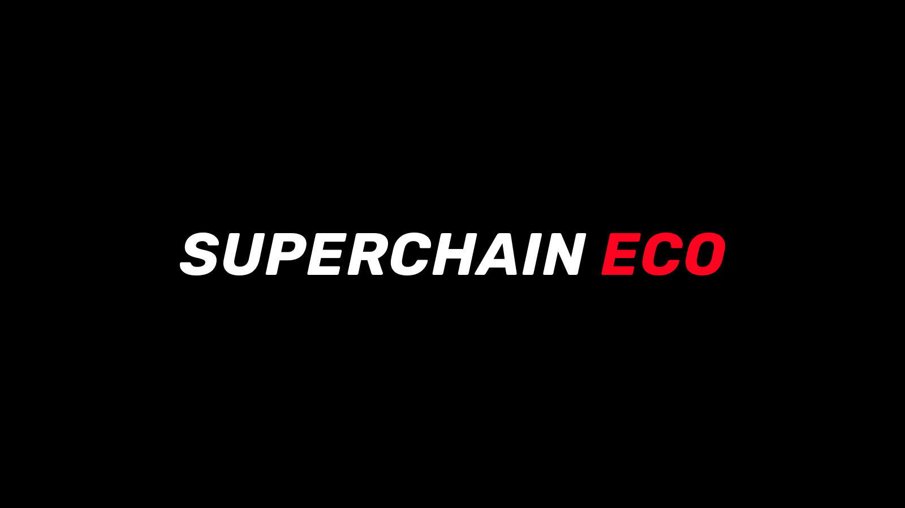
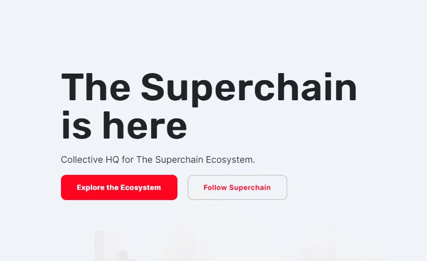
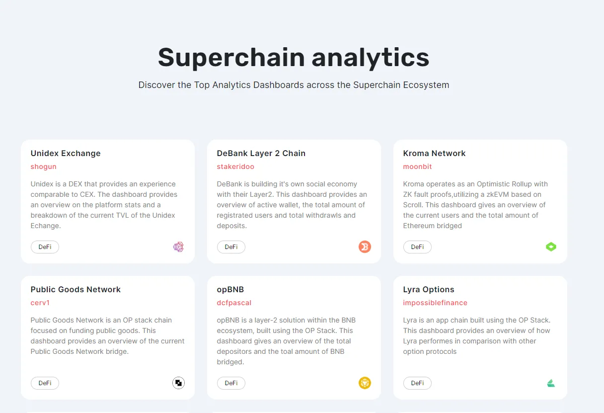
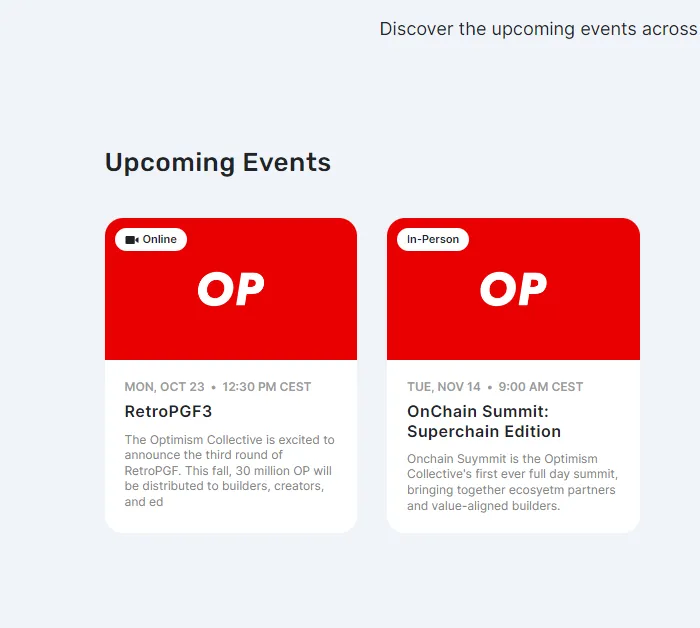
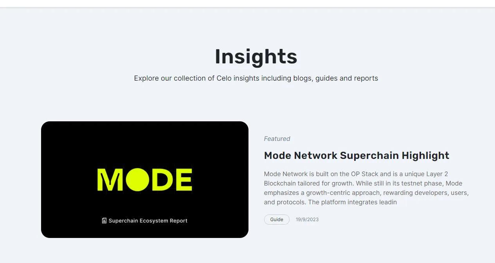

# 介绍[超级链生态系统](https://www.superchain.eco/)
> 超级链生态系统是一个将链、分析、事件和见解整合到一个生态系统中的平台。对于对 OP Stack 感兴趣的新手和有经验的开发者来说，超级链生态系统是首选目的地。

## 什么是超级链生态系统

超级链生态系统是一个致力于在 Optimism 区块链中推广 OP Stack 的平台。它提供了丰富的资源：生态系统概述、教育内容、新闻、视频教程和活动详情。用户可以获得 OP Stack 世界的广泛视角，同时深入分析、事件和见解揭示了生态系统的深度。

## 超级链生态系统的关键特性

### 生态系统——超级链生态系统的核心

生态系统突出了驱动超级链生态系统的链。拥有 17 条 OP 链、超过 500 个项目和超过 30 亿美元的 TVL（总锁仓价值），它正在蓬勃发展。像 Optimism、Base、Zora 和 Ancient8 这样的链是显著的贡献者。用户可以深入了解每条链的具体情况，从技术到项目。

### 分析：有见地的数据

超级链生态系统的分析提供了揭示超级链世界的仪表板。平台包括 Optimism、Base、Public Goods Network 和 Kroma Network。该部分为用户提供了基于数据的生态系统视角。

### 活动：社区连接

活动部分在增强社区联系方面至关重要。它向用户通报超级链活动、OP Stack 链活动，促进对话和联合项目。像在伊斯坦布尔举行的超级链聚会这样的活动展示了 Optimism 对一个充满活力、互动社区的承诺。

### 见解：知识中心

见解部分包含博客、指南和报告，深化用户对超级链世界的理解。从 Mode Network 到 Zora Network，用户可以浏览各种主题，增长他们的超级链知识。

## 全面的方法

超级链生态系统不仅仅提供见解。它深入研究 OP Stack，确保开发者拥有他们所需的一切。通过详细的信息和精心策划的活动，超级链生态系统旨在简化 Optimism 生态系统中的体验。随着它朝着超级链目标前进，它将成为 OP Stack 世界中许多人的主要接触点。无论你是经验丰富的爱好者还是新手，超级链生态系统都欢迎你。